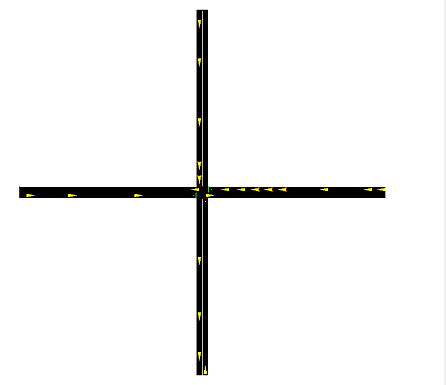
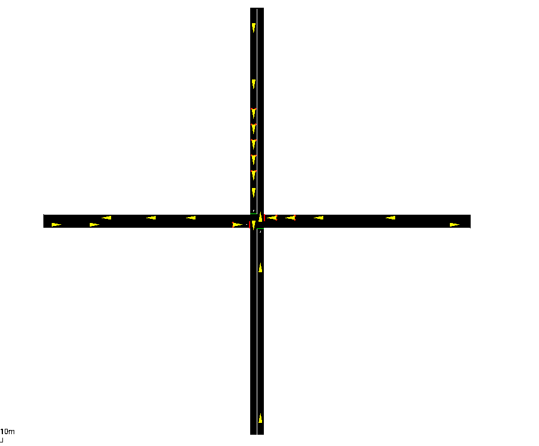
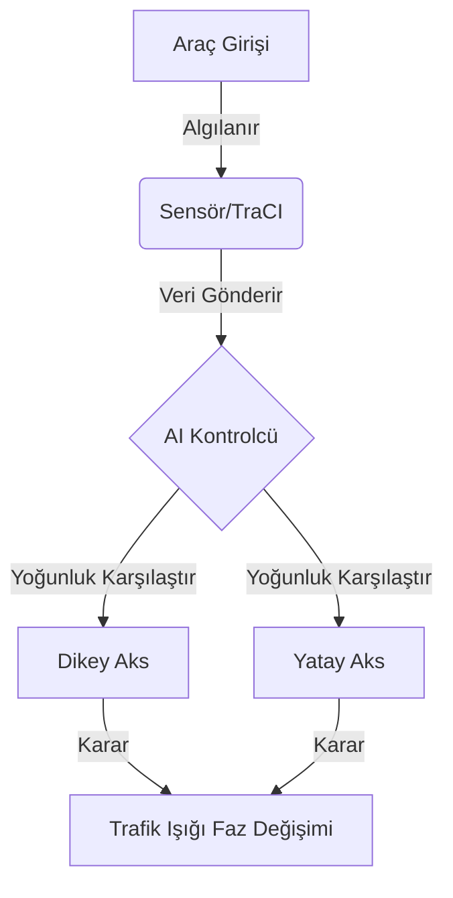

# 🚦 Akıllı Trafik Yönetim Sistemi (Yapay Zeka Destekli)

Bu projenin temel hedefi, şehir içi kavşaklarda kullanılan geleneksel ve statik trafik ışığı yönetimini, gerçek zamanlı verilere dayalı bir **"Akıllı Karar Destek Sistemi"**ne dönüştürmektir. Geleneksel sistemlerde trafik ışıkları, yoldaki araç yoğunluğundan bağımsız olarak önceden belirlenmiş sabit sürelerle çalışırken; bu projeyle birlikte trafik akışının TraCI arayüzü üzerinden anlık olarak izlenmesi ve yönetilmesi amaçlanmaktadır. Sistem, kavşağın dikey ve yatay akslarındaki araç sayılarını sensörler aracılığıyla sürekli olarak okuyarak, hangi yönde daha fazla yoğunluk olduğunu tespit eder ve önceliği otomatik olarak o yöne tanır.Bu yaklaşımın en büyük amacı, sürücülerin kavşaklarda gereksiz yere beklemesini engelleyerek bekleme sürelerini minimize etmek ve şehir içi trafik akışını optimize etmektir. Zaman tasarrufu sağlamasının yanı sıra, araçların dur-kalk sayısını azaltarak yakıt verimliliğini artırmayı ve çevreye verilen zararı azaltmak adına karbon salınımını düşürmeyi hedefler. Nihayetinde proje, akıllı şehir planlamacıları ve belediye trafik kontrol merkezleri için zaman tasarrufu sağlayan, ekonomik ve çevre dostu bir ulaşım modeli prototipi ortaya koymayı vizyon edinmiştir.


---

## 📝 Ana Senaryo ve Hedef Kitle
**Senaryo:** Şehir içi bir kavşakta, dikey ve yatay akslardaki araç yoğunluğu anlık olarak sensörler (TraCI) aracılığıyla okunur. Sistem, bekleme süresini minimize etmek için en yoğun olan yöne yeşil ışık önceliği tanır.
- **Hedef Kullanıcı:** Belediye Trafik Kontrol Merkezleri, Akıllı Şehir Planlamacıları.
- **Hizmet Amacı:** Zaman tasarrufu, yakıt verimliliği ve karbon salınımının azaltılması.

---

## 🖼️ Proje Görselleri (Ekran Görüntüleri)
Sistemin çalıştığını gösteren simülasyon görüntüleri:

| Simülasyon Görünümü 1 | Simülasyon Görünümü 2 |
| :---: | :---: |
|  |  |

---

## 🏗️ Yazılım Mimarisi ve Modelleme

### 1. Use Case (Kullanım Durumu) Diyagramı
Sistem aktörleri ve etkileşim şeması:


### 2. İş Akış Diyagramı (Flowchart)
Sistemin karar verme algoritmasının görsel akışı:

```mermaid
flowchart TD
    Start([Başlat]) --> Read[Şeritlerdeki Araç Sayısını Oku]
    Read --> Condition{Min. Yeşil Süre Doldu mu?}
    Condition -- Hayır --> Read
    Condition -- Evet --> Compare[Dikey vs Yatay Yoğunluk]
    Compare --> Action[En Yoğun Yönü Yeşil Yap]
    Action --> Loop[Simülasyon Bitene Kadar Tekrarla]
    Loop --> Read
 ```
## 🛠️ 4. Kurulum ve Çalıştırma Rehberi

1. **Repoyu Klonlayın:**
   ```bash
   git clone https://github.com/KULLANICI_ADINIZ/AkilliTrafik.git
cd AkilliTrafik
   
2. **Sanal Ortam Oluşturun:**
   ```bash
   python -m venv venv
### Windows için:
.\venv\Scripts\activate
### Mac/Linux için:
source venv/bin/activate

3. **Gereksinimleri Yükleyin:**
   ```bash
   pip install -r requirements.txt


##  ▶ Kullanım
Simülasyonu başlatmak için:

1. **Kaynak kod klasörüne girin:**
   ```bash
    cd src

2. **Dosyayı çalıştırın:**
    ```bash

    python main.py
**NOT:Araç hareketlerini SUMO arayüzünde daha net görmek için üst menüdeki Delay (ms) ayarını 400 yapmanız önerilir.
    
## 📁 5. Proje Dosya Yapısı
```text
Akilli_Trafik_Sistemi/
├── src/
│   └── main.py              # Akıllı kontrol algoritması (Python)
├── simulation/
│   ├── kavsak.net.xml       # Yol ağı dosyası
│   ├── kavsak.rou.xml       # Araç rotaları ve akış tanımları
│   └── kavsak.sumocfg       # Ana simülasyon yapılandırması
├── docs/
│   └── images/
│       ├── ekran1.png       # Simülasyon ekran görüntüsü 1
│       └── ekran2.png       # Simülasyon ekran görüntüsü 2
├── requirements.txt         # Gerekli Python kütüphaneleri
└── README.md                # Proje sunumu ve kullanım kılavuzu
---
```

## 👤 Hazırlayanlar:

```yaml
-Atahan Öztürk 
-Merve Sarı 
-Muhammet Sefa Akay 
-Güven Karataş 
-Halil Emrah Kaya 


