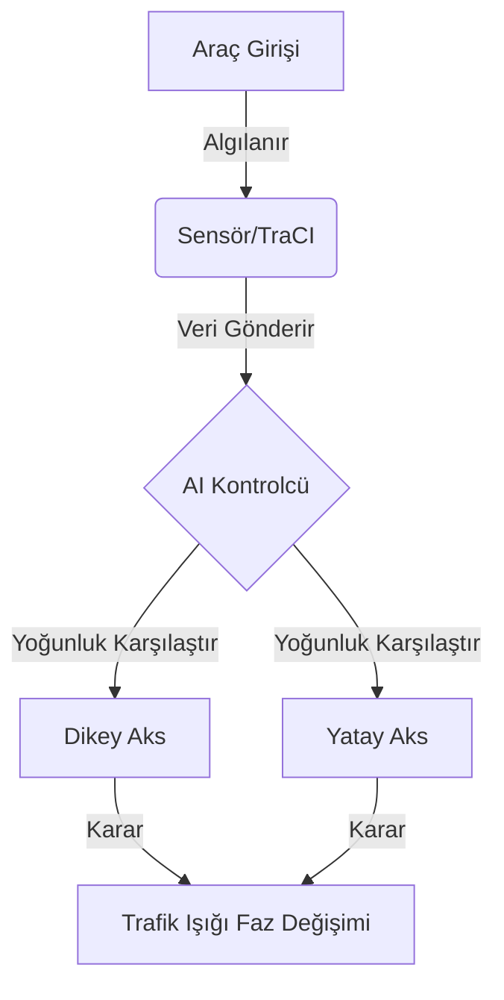

# 🚦 Akıllı Trafik Yönetim Sistemi (Yapay Zeka Destekli)

Bu proje Geleneksel sabit süreli trafik ışıklarını, gerçek zamanlı araç yoğunluğuna göre optimize eden bir **"Akıllı Karar Destek Sistemi"**dir.

---

## 📝 Ana Senaryo ve Hedef Kitle
**Senaryo:** Şehir içi bir kavşakta, dikey ve yatay akslardaki araç yoğunluğu anlık olarak sensörler (TraCI) aracılığıyla okunur. Sistem, bekleme süresini minimize etmek için en yoğun olan yöne yeşil ışık önceliği tanır.
- **Hedef Kullanıcı:** Belediye Trafik Kontrol Merkezleri, Akıllı Şehir Planlamacıları.
- **Hizmet Amacı:** Zaman tasarrufu, yakıt verimliliği ve karbon salınımının azaltılması.

---

## 🖼️ Proje Görselleri (Ekran Görüntüleri)
Sistemin çalıştığını gösteren simülasyon görüntüleri:

| Simülasyon Görünümü 1 | Simülasyon Görünümü 2 |
| :---: | :---: |
|  |  |

---

## 🏗️ Yazılım Mimarisi ve Modelleme

### 1. Use Case (Kullanım Durumu) Diyagramı
Sistem aktörleri ve etkileşim şeması:


### 2. İş Akış Diyagramı (Flowchart)
Sistemin karar verme algoritmasının görsel akışı:

```mermaid
flowchart TD
    Start([Başlat]) --> Read[Şeritlerdeki Araç Sayısını Oku]
    Read --> Condition{Min. Yeşil Süre Doldu mu?}
    Condition -- Hayır --> Read
    Condition -- Evet --> Compare[Dikey vs Yatay Yoğunluk]
    Compare --> Action[En Yoğun Yönü Yeşil Yap]
    Action --> Loop[Simülasyon Bitene Kadar Tekrarla]
    Loop --> Read
 ```
## 🛠️ 4. Kurulum ve Çalıştırma Rehberi

Hocamızın isteği üzerine, projenin her bilgisayarda hatasız çalışması için **Sanal Ortam (venv)** yapısı kullanılmıştır.

**Adım Adım Kurulum:**

1. **Repoyu Klonlayın:** `git clone [REPO_LINKI]`
2. **Sanal Ortam Oluşturun:** `python -m venv venv`
3. **Aktif Edin:** `venv\Scripts\activate` (Windows)
4. **Kütüphaneleri Yükleyin:** `pip install -r requirements.txt`
5. **Çalıştırın:** `cd src` -> `python main.py`

##📁 5. Proje Dosya Yapısı
```text
Akilli_Trafik_Sistemi/
├── src/
│   └── main.py              # Akıllı kontrol algoritması (Python)
├── simulation/
│   ├── kavsak.net.xml       # Yol ağı dosyası
│   ├── kavsak.rou.xml       # Araç rotaları ve akış tanımları
│   └── kavsak.sumocfg       # Ana simülasyon yapılandırması
├── docs/
│   └── images/
│       ├── ekran1.png       # Simülasyon ekran görüntüsü 1
│       └── ekran2.png       # Simülasyon ekran görüntüsü 2
├── requirements.txt         # Gerekli Python kütüphaneleri
└── README.md                # Proje sunumu ve kullanım kılavuzu
---
```

## 👤 Hazırlayanlar:

```yaml
-Atahan Öztürk 
-Merve Sarı 
-Muhammet Sefa Akay 
-Güven Karataş 
-Halil Emrah Kaya 


